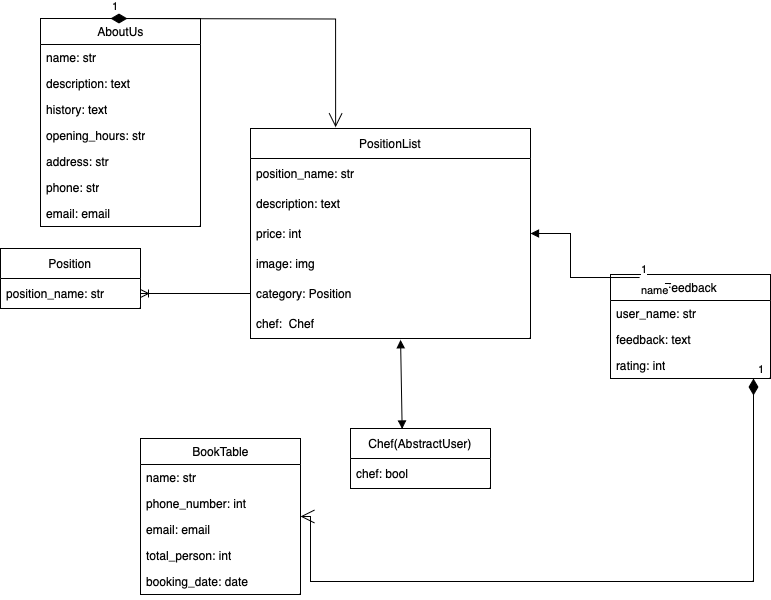

# fast-food-web-restaurant

A Django-powered web application for a fast food restaurant. 
Users can view the menu, book tables, and leave feedback, 
while admins can manage restaurant data through a custom admin interface.

## DATA BASE SCHEMA

## Check it out!

## Features

- Browse and filter menu items by category and price
- Book tables through a dynamic form with input validation
- Submit and display customer feedback
- Admin panel for managing:
  - Menu categories and items
  - Chefs (custom user model)
  - "About Us" section
  - Feedback and bookings

## Installation
git clone https://github.com/weuis/fast-food-web-restaurant.git
cd fast_food_web_restaurant
python3 -m venv venv
source venv/bin/activate
python3 manage.py runserver

## Tech Stack

- **Backend**: Django 4.x (Python)
- **Database**: SQLite (default), compatible with PostgreSQL/MySQL
- **Frontend**: HTML5, CSS3 (with basic templates)
- **Admin**: Django built-in admin, customized views

